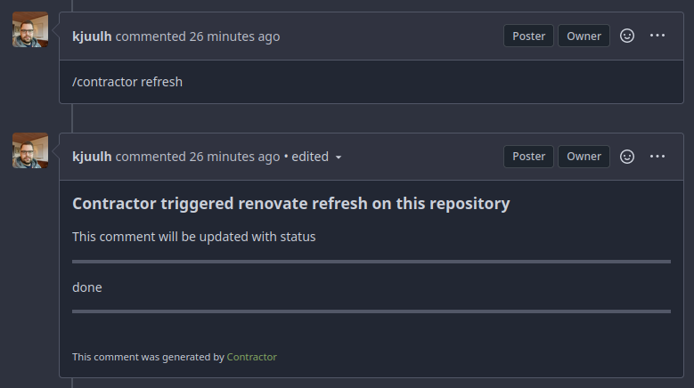

# Contractor - A renovate bot for gitea and github

Contractor is a chatops like bot, integrating with github/gitea issues, allowing commands to trigger renovate runs.

```bash
/contractor refresh	
```

Contractor runs in a regular docker image and uses the official renovate slim image behind the scenes, this can be changed in the configuration.



## Getting started

First you need to pull and run the contractor image, docker is the preferred way of execution, but golang is also available from source.

Docker compose is given as an example, but you're free to run using `docker run` if you prefer.

See example for a ready-to-run image

```yaml
# file: docker-compose.yaml
version: "3"
services:
  contractor:
	  image: docker.io/kjuulh/contractor:latest
		restart: unless-stopped
		commands:
		- contractor server serve
		volumes:
	  - "./templates/contractor:/mnt/config"
		- "/var/run/docker.sock:/var/run/docker.sock"
		env_file:
	  - .env
```

```bash
# file: .env
GITEA_RENOVATE_TOKEN=<gitea application token> # needs repo and pull request permissions
GITHUB_RENOVATE_TOKEN=<github personel access token> # needs repo and pull request permissions
GITHUB_COM_TOKEN=<github personel access token> # used for communication, doesn't need much
RENOVATE_SECRETS='{"HARBOR_SERVER_PASSWORD": "<whatever secret you need in your config>"}'
CONTRACTOR_API_KEY='<some sufficiently secret password used for webhooks to authenticate to your server>'
```

```json
// file: templates/contractor/config.json
{
  "$schema": "https://docs.renovatebot.com/renovate-schema.json",
  "platform": "gitea",
  "extends": [
    "config:base"
  ]
}
// Remember to fill out the options as you see fit, this is not a complete example
```

Use renovate secret for each `{{ secrets.HARBOR_SERVER_PASSWORD }}` in your config, replace `HARBOR_SERVER_PASSWORD` with your own

And then run the server with: `docker compose up`

This has started the server, but github doesn't know that it needs to talk to you yet.

As such host the server somewhere with a public hostname, such that github or gitea webhooks can reach it, i.e. contractor.some-domain.com:9111

To install the webhook, either use the docker image, or download the cli from source.

### CLI

To install the cli

```bash
go install git.front.kjuulh.io/kjuulh/contractor@latest	
```

contractor will automatically read any .env file, so you can leave out the secrets.

```bash
contractor install --owner kjuulh --repository contractor --url https://git.front.kjuulh.io/api/v1 --backend gitea	
```

If you leave any of these out, contractor will prompt your for required values.

### Docker

You can also use docker for it.

```bash
docker compose run contractor install --owner kjuulh --repository contractor --url https://git.front.kjuulh.io/api/v1 --backend gitea	
```

### GitHub App

TBD, this should automatically install the webhook for allowed repositories, I just haven't gotten around to it yet. It is on the 0.3.0 Roadmap.
